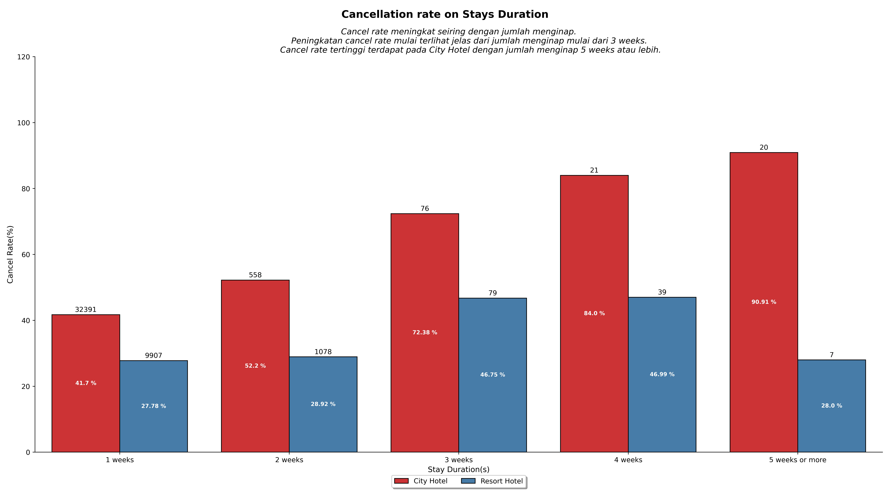

# About the project
It is very important for a company to consistently analyze its business performance. On this occasion, we will delve deeper into the hospitality industry. The focus we aim for is to understand how our customers behave when making hotel reservations and its connection to the hotel reservation cancellation rates. The results of the insights we discover will be presented in the form of data visualization for easier comprehension and a more persuasive nature.

# Objective
- Perform data preprocessing to have good data visualization.
- Analyze and visualiza campany business metrics.

# Research Question
 - Is there any feature need to modify to ease visualization process?
 - Does month affect hotel booking numbers?
 - Does stay duration booking have corelation with cancel rates?
 - Does lead time have effect on cancel rates?

 # Hypotesis
 - Date time need to be have type as datetime and some feature with certain values need to change to simplify process.
 - There will be some difference in months booking number regarding on season holiday or cutomer behavior.
 - Shorter stay duration will probably have higher cancel rates due to cheaper booking fee.
 - Low lead time will have lower potetial to have cancel rates, as result of low time to change mind in booking.

 # Data
 Data were a dataset from hotel company from 2017 to 2019.

 # Data Preprocessing
 There is some missing values in dataset, we try to fill with 0 and unknown. For categorical columns we adjust some values in meal column. Encode month column to have right order of month in visualization.

# Analysis
## Number of Hotel Bookings per Month

The City Hotel is the most favored type of hotel compared to the Resort Hotel. The months from January to March experience the lowest average bookings. The City Hotel records its highest number of bookings in July, with an average of 4092 bookings. This might be due to the presence of significant holidays towards the end of June. Additionally, there is also an increase in bookings towards the end of the year, in November and December, possibly due to the rise in holiday periods.

## Cancellation rate on Stays Duration

The cancellation rate increases in line with the number of stays. The escalation in the cancellation rate becomes evident when the number of stays reaches a duration of 3 weeks. The highest cancellation rate is observed in the City Hotel, particularly for stays of 5 weeks or longer.

## Cancellation rate on Lead Time

The cancellation rate rises in tandem with the Lead Time. The increase in cancellation rate becomes distinctly evident for Lead Time starting from <= 1 Month. A low cancellation rate is observed for Lead Time D-day and <= 1 Week.

# Summary
Number of booking in hotel company have differences each month, most possibility reasin is because holiday season. Lower cancellation rate is achieve from low lead time and low stay duration.

# Recommendation
- Booking discount for D-day or < 1 week booking on holiday season. This method can reduce cancellation rate in high booking season and can maximize profit with voiding vacant rooms beacuse cancel booking.
- Give promo to Resort Hotel booking with 5 weeks or more stay duration. This method will increase interest in resort hotel booking and more safe because have low cancel rates.